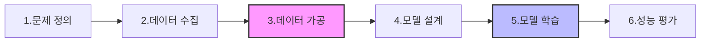

# 1장. 딥러닝과 파이토치 개요

---

## 1.1 머신러닝과 딥러닝

### 1. 인공지능의 진화: 전문가 시스템에서 머신러닝으로

#### **초기 단계: 전문가 시스템 (Expert System)**
![[Pasted image 20260219123136.png]]
- **정의:** 특정 분야의 전문가 지식을 `if-else` 구문(사례집)으로 프로그래밍한 시스템.
- **특징:** 인간이 입력한 지식 베이스 내에서만 동작함. (예: 질병 진단 시스템 '덴드랄')
- **한계:**
    - **학습 부재:** 단순히 입력된 데이터를 찾아볼 뿐, 스스로 시행착오를 겪으며 성장하지 않음.
    - **확장성 부족:** 미리 등록되지 않은 정보는 알지 못하며, 복잡한 문제일수록 계산량이 기하급수적으로 증가함.

#### **발전 단계: 머신러닝 (Machine Learning)**
- **정의:** 데이터를 바탕으로 기계가 스스로 규칙을 찾아내고 성능을 개선하는 알고리즘.
- **핵심 원리:** 문제를 단순화하여 **가설(직선/평면)** 을 세우고, 반복적인 **시행착오**를 통해 데이터에 가장 적합한 모델을 찾아냄.
- **문제 유형:**
    1. **회귀(Regression):** 연속적인 값을 예측.
    2. **분류(Classification):** 데이터를 특정 범주로 나눔.

---

### 2. 결정 경계(Decision Boundary)의 이해

데이터를 구분하거나 예측하기 위해 사용하는 '선'이나 '면'을 의미합니다. 차원에 따라 부르는 명칭이 달라집니다.

| **차원** | **명칭** | **시각적 형태** |
| :--- | :--- | :--- |
| **2차원** | 결정 경계 / 가설 | 직선 |
| **3차원** | 초평면 (Hyperplane) | 평면 |
| **고차원** | 초평면 | 다차원 공간을 나누는 경계 |

![[Pasted image 20260219123532.png]]

---

### 3. 인공지능, 머신러닝, 딥러닝의 포함 관계

세 개념은 별개의 기술이 아니라, 서로를 포함하는 계층적 관계입니다.

1. **인공지능 (AI):** 인간의 지능을 모방한 모든 기술 (전문가 시스템 포함).
2. **머신러닝 (ML):** AI 중 데이터를 통해 **스스로 학습**하고 성능을 개선하는 기술.
3. **딥러닝 (DL):** 머신러닝 중 **인공 신경망(ANN)**을 활용하여 깊게 학습하는 기술.

---

### 4. 지능의 수준에 따른 분류

- **약 인공지능 (Weak AI):** 특정 분야의 문제만 해결할 수 있는 지능 (현재 대부분의 AI).
- **강 인공지능 (Strong AI):** 사람처럼 모든 영역에서 사고하고 해결 능력을 갖춘 지능.

> [!info] 요약
> 과거의 AI(전문가 시스템)는 사람이 준 정답지만 읽는 수준이었다면, **머신러닝**은 스스로 문제를 풀며 오답 노트를 작성(시행착오)하여 실력을 키우는 방식입니다. 그중에서도 인간의 뇌 구조를 본뜬 모델이 바로 **딥러닝**입니다.

---

## 1.2 지도 학습, 비지도 학습, 강화 학습

### 머신러닝의 3가지 학습 방법

머신러닝은 데이터의 성격(정답 유무)과 학습 방식에 따라 크게 세 가지로 분류됩니다.

#### 1. 지도 학습 (Supervised Learning)
![[Pasted image 20260219162613.png]]
- **핵심:** **"정답(Label)이 있는 데이터"**로 학습합니다.
- **원리:** 문제(데이터)와 정답을 함께 주어 기계가 그 관계를 파악하게 합니다. 학습 후 새로운 데이터를 주면 정답을 예측합니다.
- **예시:** 고양이 사진(데이터) + "고양이"(정답)를 학습 → 처음 보는 사진이 고양이인지 토끼인지 분류.
- **활용:** 분류(Classification), 회귀(Regression).

#### 2. 비지도 학습 (Unsupervised Learning)
![[Pasted image 20260219162646.png]]
- **핵심:** **"정답이 없는 데이터"**에서 스스로 구조를 찾아냅니다.
- **원리:** 데이터 간의 유사성이나 상관관계를 분석하여 특정한 패턴을 발견합니다.
- **예시:** 구매 이력 데이터를 분석하여 비슷한 취향을 가진 고객끼리 묶기.
- **활용:** 클러스터링(군집화), 이상치 탐지(Anomaly Detection).

#### 3. 강화 학습 (Reinforcement Learning)
![[Pasted image 20260219162655.png]]
- **핵심:** 데이터 대신 **"환경과의 상호작용"**을 통해 학습합니다.
- **원리:** 인공지능이 특정 행동을 했을 때, 결과가 좋으면 **보상(Reward)**을, 나쁘면 **벌**을 주어 보상을 최대화하는 방향으로 행동을 수정해 나갑니다.
- **예시:** 알파고(바둑), 자율주행, 게임 AI.
- **특징:** 별도의 학습 데이터셋이 반드시 필요하지 않으며, 시행착오를 통해 스스로 개선합니다.

---

### 💡 한눈에 비교하는 학습 방법

| **구분** | **지도 학습** | **비지도 학습** | **강화 학습** |
| :--- | :--- | :--- | :--- |
| **데이터 정답** | 있음 (Label) | 없음 | 없음 (보상 기반) |
| **학습 목표** | 정답 맞히기 | 데이터 구조 찾기 | 보상 극대화 |
| **대표 사례** | 스팸 분류, 주가 예측 | 고객 세분화, 뉴스 그룹화 | 알파고, 로봇 제어 |

---

## 1.4 파이토치 권고 코딩 스타일

### 1. 딥러닝 프레임워크의 필요성

딥러닝 모델은 데이터 처리, 가중치 계산 및 수정 등 복잡한 알고리즘의 집합체입니다. 이를 개발자가 매번 밑바닥부터 직접 구현하는 것은 비효율적이기 때문에, **필요한 도구들을 미리 모아놓은 프레임워크**를 사용합니다.

---

### 2. 주요 프레임워크 비교

| **프레임워크**             | **주요 특징**                              |
| :-------------------- | :------------------------------------- |
| **파이토치 (PyTorch)**    | 메타 개발. 파이썬과 유사한 직관적 코드. 연구/논문 점유율 압도적. |
| **텐서플로 (TensorFlow)** | 구글 개발. 다양한 플랫폼(모바일, 웹 등) 배포 강점.        |
| **케라스 (Keras)**       | 텐서플로 고수준 API. 쉽고 빠른 모델 설계 가능.          |

---

### 3. 왜 파이토치(PyTorch)인가?

- **연구 분야의 표준:** 최신 기술(SOTA)을 접하기에 가장 유리합니다.
- **파이썬 친화적 (Pythonic):** 코드가 직관적이고 학습 곡선이 낮습니다.
- **강력한 커뮤니티:** 문제 해결을 위한 정보 공유가 원활합니다.

> [!info] 요약
> 딥러닝 프레임워크는 복잡한 계산을 대신 해주는 **종합 도구 상자**와 같습니다. 그중 **파이토치**는 직관적인 코드와 높은 연구 점유율 덕분에 현재 학습과 연구에 가장 최적화된 선택입니다.

---

## 1.5 파이토치 핵심 구성 요소

### 1. 텐서(Tensor)의 기본 연산
파이토치의 기초 데이터 단위입니다.

```python
import torch

# 텐서 생성
a = torch.tensor([1, 2, 3])
b = torch.tensor([4, 5, 6])

# 합 계산
c = a + b
print(c) # tensor([5, 7, 9])
```

### 2. 모델 클래스 (nn.Module)
신경망 구조와 동작을 정의하는 설계도입니다.

```python
import torch.nn as nn

class Net(nn.Module):
    def __init__(self):
        super().__init__()
        # 1. 신경망 부품 정의
        # self.layer1 = nn.Linear(10, 5)

    def forward(self, input):
        # 2. 데이터 흐름 정의
        # output = self.layer1(input)
        return output
```

### 3. 데이터셋 클래스 (Dataset)
학습 데이터를 불러오고 처리하는 틀입니다.

```python
class Dataset():
    def __init__(self):
        # 1. 데이터 로딩 및 경로 설정

    def __len__(self):
        # 2. 데이터 총 개수 반환
        return len(data)

    def __getitem__(self, i):
        # 3. i번째 데이터와 정답 반환
        return data[i], label[i]
```

### 4. 학습 루프 (Training Loop)
데이터를 모델에 넣어 실제로 가중치를 수정하는 과정입니다.

```python
for data, label in DataLoader():
    # 1. 예측값 계산 (순전파)
    prediction = model(data)
    
    # 2. 오차 계산
    loss = LossFunction(prediction, label)
    
    # 3. 오차 역전파 (기울기 계산)
    loss.backward()
    
    # 4. 가중치 수정 (최적화)
    optimizer.step()
```

---

## 1.6 딥러닝 문제 해결 6단계 프로세스

### **STEP 1: 준비 단계 (Data & Problem)**
1. **해결할 문제 정의:** 목표 및 입출력 관계 명확화.
2. **데이터 수집:** 정답(Label)이 포함된 데이터 확보.
3. **데이터 가공 (전처리):** 노이즈 제거 및 학습 가능 상태로 변환.


### **STEP 2: 구현 및 학습 단계 (Modeling)**
4. **딥러닝 모델 설계:** 알고리즘 및 구조 결정.
5. **딥러닝 모델 학습:** 손실(Loss) 최소화 방향으로 가중치 수정.

### **STEP 3: 검증 단계 (Evaluation)**
6. **성능 평가:** 새로운 데이터로 객관적인 실력 확인.

![[Pasted image 20260219174503.png]]

---

### 💡 한눈에 보는 흐름도



---

### 📋 딥러닝 문제 해결 단계별 체크리스트

#### 1. 풀어야 할 문제 이해하기
- 회귀 문제인가? / 분류 문제인가?

#### 2. 데이터 파악하기
- 자료형 및 정답 확인, 클래스 불균형 점검, 결측치 및 오류 확인.

#### 3. 데이터 전처리
- 데이터 증강 (Data Augmentation), 데이터 정규화 (Normalization).

#### 4. 신경망 설계
- 합성곱(CNN) 적용(공간 정보), 순환 신경망(RNN) 적용(순서 정보).

#### 5. 신경망 학습
- 손실 함수, 최적화 기법(Optimizer), 평가 지표(Metric) 설정.

---

### 🚨 트러블슈팅 가이드

**상황 A: 손실(Loss)이 무한대로 발산할 때**
- 손실 함수 변경 검토.
- 데이터 셋 내 이상치(Outlier) 점검.
- 학습률(Learning Rate) 감소 시도.

**상황 B: 손실(Loss)이 0으로 수렴할 때 (과적합 의심)**
- 학습 데이터 양 점검.
- 신경망 크기(은닉층/노드 수) 축소 검토.

---

## 1.7 딥러닝을 위한 필수 통계 개념

### 1. 독립변수와 종속변수
![[Pasted image 20260220102109.png]]
- **독립변수 (Input):** 결괏값을 결정하는 원인 (입력 데이터).
- **종속변수 (Output):** 독립변수에 의해 결정되는 값 (예측값/목푯값).

### 2. 평균과 분산
- **평균 (Mean):** 데이터의 중심 위치.
- **분산 (Variance):** 데이터가 평균을 중심으로 퍼진 정도.
- **표준편차 (Standard Deviation):** 분산의 제곱근.

![[Pasted image 20260220102949.png]]

---

## 1.8 시각화 도구 (Matplotlib)

![[Pasted image 20260220103156.png]]

### 1. 주요 그래프 활용

**1) 선형 그래프 (Line Plot)**
순서가 있는 데이터의 변화 확인.
![[Pasted image 20260228194314.png]]
```python
plt.plot(t, t2, label="t2")
plt.plot(t, t3, label="t3")
plt.title("Line Plots")
plt.legend()
plt.show()
```

**2) 서브플롯 (Subplot)**
여러 그래프를 나란히 배치하여 비교.
![[Pasted image 20260228194310.png]]
```python
plt.subplot(1, 2, 1)
plt.plot(t, t)
plt.subplot(1, 2, 2)
plt.plot(t, t3)
plt.show()
```

**3) 히스토그램 (Histogram)**
데이터의 전체적인 분포도 확인.
![[Pasted image 20260228194306.png]]
```python
plt.hist(x, 50, density=1, facecolor='g', alpha=0.75)
plt.title('Histogram')
plt.show()
```
